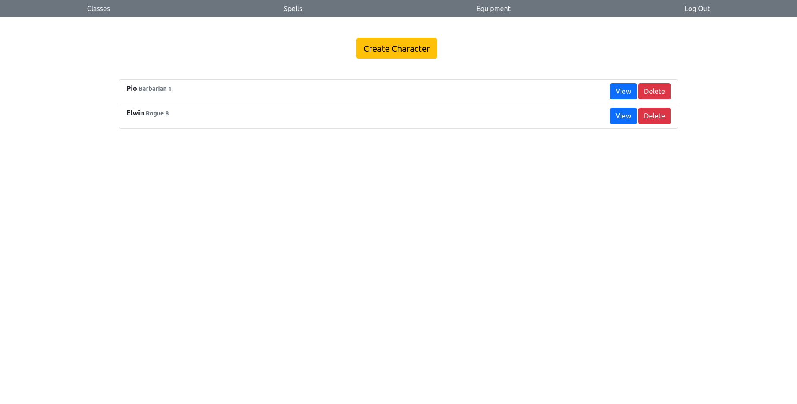

# Pen 'n' Paper
In D&D, each player creates a character who is an adventurer and teams up with other adventurers.The DM runs adventures for the characters, who navigate its hazards and decide which paths to explore. The DM describes the locations and creatures that the adventurers face, and the players decide what they want their characters to do. Then the DM determines the results of the adventurers’ actions and narrates what they experience. Because the DM can improvise to react to anything the players attempt, D&D is infinitely flexible, and each adventure can be unexpected.

##  How to play

1. The DM Describes the Environment
- The DM tells the players where their adventurers are and what’s around them, presenting the basic scope of options that present themselves
2. Players Describe Desired Actions
- Sometimes one player speaks for the whole party. Other times, different adventurers do different things. The players don’t need to take turns, but the DM listens to every player and decides how to resolve those actions.
3. The DM Narrates the Results.
- Describing the results often leads to another decision point, which brings the flow of the game right back to step 1.

### Technologies Used
- HTML
-  CSS 
-  JavaScript
- Express Node.js
-  REST APIs
  -- https://api.open5e.com/weapons/
  -- https://api.open5e.com/spells/ 
  -- https://api.open5e.com/classes/
-  Oauth Authorization
 
### Getting Started:
Website: https://pen-n-paper-rpg.herokuapp.com

### Icebox Items:
- Implement more character sheet features
- Sharing character sheets with other players

### Reference:
* Google Fonts
* Bootstrap
* Open5e

